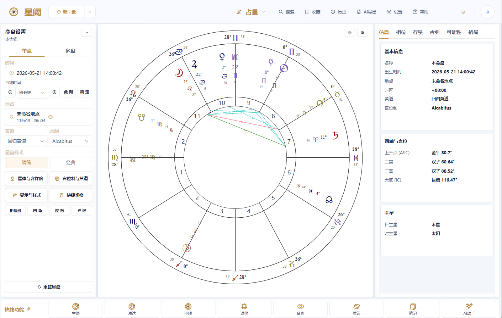
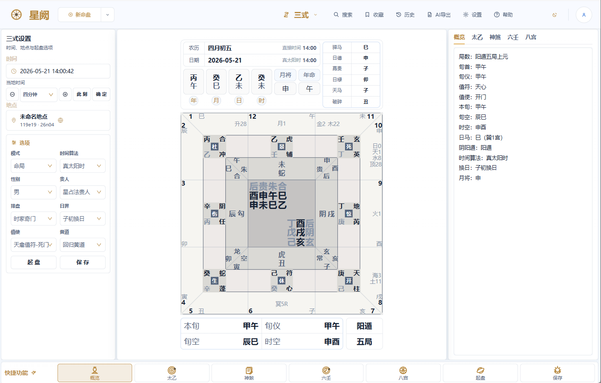
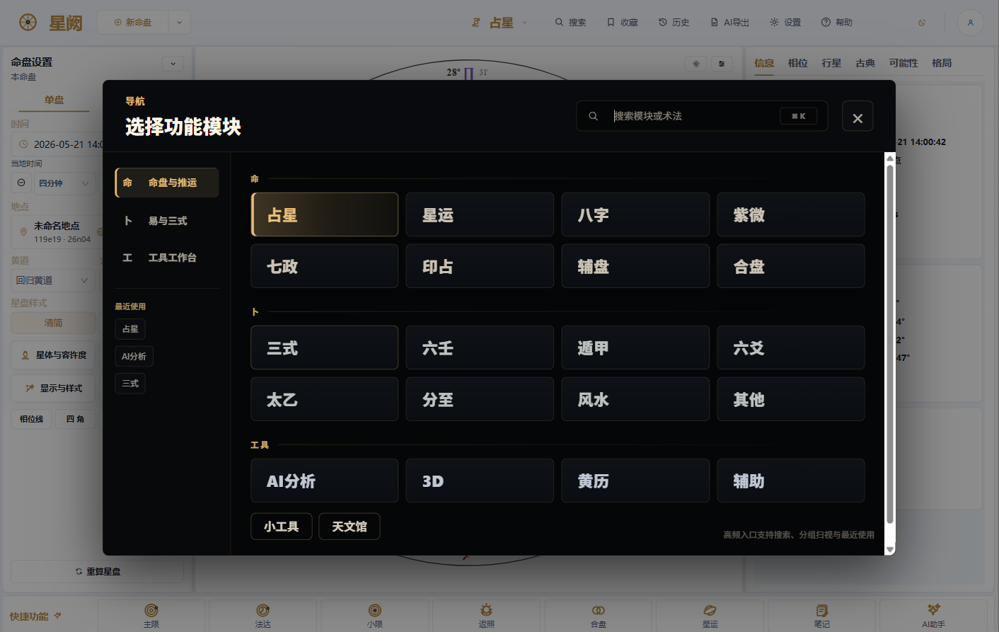

简体中文 · [English](README_EN.md)

# 星阙 Horosa

**把占星与中国术数，收进一个原生 Windows 工作站** 
*Western astrology and Chinese metaphysics, in one native Windows workstation*

[下载安装包](https://github.com/Horace-Maxwell/Horosa-Web-App-comprehensively-improved-Windows/releases/latest/download/Horosa-Setup-2.6.7.exe) ·
[完整中文说明](README_ZH.md) ·
[English Guide](README_EN.md) ·
[所有版本](https://github.com/Horace-Maxwell/Horosa-Web-App-comprehensively-improved-Windows/releases)

---

星阙 Horosa 是一套桌面端的玄学工作站。西方占星的本命、推运、关系盘，连同八字、紫微、奇门、六壬、太乙这些中国传统术数，被放进同一个原生 Windows 应用里——不必在十几个网页排盘器之间来回切换，也不必自己拼装 Python、Java 与历表运行时。它以 NSIS 离线安装包的形式交付，运行时随包自带，全新 Windows 10/11 x64 机器下载即用。

> Horosa is a desktop workstation for traditional cosmology. Western natal, timing, and relationship astrology sit beside Chinese systems—Bazi, Ziwei, Qimen, Liuren, Taiyi—inside one native Windows app, so you stop juggling a dozen web tools and never hand-assemble a Python/Java/ephemeris runtime yourself. It ships as an offline NSIS installer with the runtime bundled in, ready to run on a clean Windows 10/11 x64 machine.

## 下载 · Download

普通用户直接下载离线安装包，像任何 Windows 软件一样安装打开即可。无需自备 Python 或 Java，运行时已随包交付；更新只替换程序与共享组件，不会清空你的命例数据。首次启动会因解包与校验稍慢，之后复用本地缓存。

> Regular users grab the offline installer and open it like any finished Windows app. No Python or Java to install yourself—the runtime ships inside the package—and updates replace the program and shared runtime without wiping your saved charts. The first launch is a little slower while the runtime is extracted and verified; later launches reuse the local cache.

**[⬇︎ Horosa-Setup-2.6.7.exe](https://github.com/Horace-Maxwell/Horosa-Web-App-comprehensively-improved-Windows/releases/latest/download/Horosa-Setup-2.6.7.exe)**

适合：Windows 10/11 · `x64` · 弱网 / 离线环境 · 首次安装 · 转发给他人。

> 安装包当前未做 Authenticode 签名，首次运行 SmartScreen 可能提示「更多信息 → 仍要运行」。
> The installer is not yet Authenticode-signed, so SmartScreen may ask you to choose "More info → Run anyway" on first launch.

## 截图 · Screenshots

<em>占星工作区 — 左侧起盘参数，中间图盘画布，右侧信息 / 相位 / 行星 / 古典 / 格局页签。</em> <em>Astrology workspace — chart controls on the left, the wheel in the center, detail tabs on the right.</em>

<em>三式工作区 — 起盘参数、九宫盘面、概览 / 太乙 / 神煞 / 六壬 / 八宫页签同屏。</em> <em>Sanshi workspace — setup, the nine-palace plate, and overview tabs in one view.</em>

<em>导航弹层 — 命盘推运、易与三式、工具工作台分组，支持搜索与最近使用。</em> <em>Command overlay — charts, Yi & Sanshi, and tools, with search and recents.</em>

## 功能总览 · What's Inside

导航把所有模块归为三组：**命**（命盘与推运）、**卜**（易与三式）、**工具**。下面是各组里实际可用的内容。

> Everything lives under three groups: **命** charts & timing, **卜** divination, and **工具** tools. Here is what each one actually ships.

### 命 · Charts & Timing

| 模块 | 说明 |
| --- | --- |
| **占星 Astrology** | 本命盘与三维盘（Babylon.js 实时 3D），多种宫位制与古典 / 现代行星集 |
| **星运 Timing** | 主限法（Primary Directions）、黄道星释（Zodiacal Releasing）、法达（Firdaria）、小限（Profection）、太阳弧（Solar Arc）、太阳 / 太阴返照、十年法、推运、星历 |
| **合盘 Relationship** | 比较盘、组合盘、影响盘、时空中点盘、马克斯盘 |
| **辅盘 Specialty** | 希腊星术（界限 / 阿拉伯点）、量化盘 / 中点树（汉堡学派）、星体地图（占星地理定位）、调波盘 |
| **印占 Vedic** | 北 / 南 / 东印度盘，恒星黄道 |
| **七政 Qizheng** | 七政四余、七政 Moira |
| **八字 Bazi · 紫微 Ziwei** | 四柱排盘；紫微斗数含四化盘 |
| **数算 · 其他** | 邵子神数、铁板神数、演禽等数术方法 |

### 卜 · Divination

| 模块 | 说明 |
| --- | --- |
| **三式 Sanshi United** | 奇门、太乙、六壬整合面：概览、太乙、神煞、六壬、大格、小局、参考、八宫 |
| **遁甲 Qimen · 六壬 Liuren · 太乙 Taiyi** | 三式各自的独立排盘入口 |
| **六爻 Liuyao · 分至 Jieqi · 风水 Feng Shui** | 纳甲六爻、节气盘、风水工具 |
| **其他 More** | 宿盘、金口诀、统摄法、皇极经世、五兆、太玄、荆诀、神易数 |

### 工具 · Tools

| 模块 | 说明 |
| --- | --- |
| **AI 分析 AI Analysis** | 接入 OpenAI / Anthropic / Gemini / Ollama / OpenRouter / 自定义端点；支持流式对话、历史记录、资料库（向量检索）、按技法 / 页签结构化导出 |
| **天文馆 Planetarium** | Babylon.js 实时三维天象 |
| **黄历 Almanac** | 农历 / 节气 / 择日 |
| **辅助 References** | 八卦类象、十二宫、规则速查 |

命盘与事盘都能本地保存：带标签、快照、后端原始数据，可 JSON 导入导出，重开后恢复现场。

> Charts and cases save locally—tags, snapshots, raw backend payloads, JSON import/export, and full restore on reopen.

## 本次更新 · What's New in v2.6.7 beta

**v2.6.7 = 古典占星补全 + 围攻详断 + AI 古典挂载**：本命盘新增完整古典 / 希腊占星参数与格局，分列「古典」「格局」两个标签；新增十六式围攻详断；AI 分析 / 导出快照新增「古典」段（四同步一致）；「信息」标签新增格局速览；另修埃及历天狼偕日升在高纬度下纪年与日期不一致。后端 AI 代理与缓存层加固（流式工作线程池 + ParamHash 本地缓存治理）→ 已重建 astrostudyboot.jar。命盘其余计算与 v2.6.6 完全一致；v2.6.6 之前所有功能保留。

—— 以下 v2.6.7 主要更新 ——

- **古典 · 命盘参数**（新「古典」标签）：出界（Out of Bounds）、偕日相（含偕日升 / 没）、喜乐宫、昼夜宗派、野逸、度数明暗空烟与阴阳度、特殊度数、二十八月站、远地点、单度主星 / 九分 / Darijan。
- **古典 · 格局分析**（新「格局」标签）：古典格局（护卫 / 优势相位 / 度数围攻）、相位动态（入相出相 / 左右旋 / 传光 / 聚光 / 不合意 / 交点弯曲）、逐题主星、偶然尊贵、比尼 / 王者恒星、行星时、埃及历、巴比伦参照星、交食食分、全身部位 melothesia。
- **围攻详断（十六式）**：三围（火土凶 / 金木荣富 / 日月耀贵）+ 春秋势 + 宰执夏冬 + 协防截击 + 围魏救赵 + 日木互容制约 + 逆行，附断语。
- **AI 古典挂载**：AI 分析与导出快照新增「古典」段；导出 / 导出设置 / 挂载 / 储存四处一致；老用户分段设置自动并入。
- **回应 issue #27**（@zuojun1991「希望有偕日升 / 偕日落 / 出界」）：本版「古典」标签已完整加入出界与偕日相（含偕日升 / 没）。

> v2.6.7 — a classical-astrology augmentation: the natal chart gains a full set of classical / Hellenistic parameters and configurations across new 古典 (Classical) and 格局 (Configurations) tabs (Out of Bounds, phasis with heliacal rising/setting, houses of joy, day/night sect, feral, degree quality, special degrees, the 28 lunar mansions, apogee, monomoiria/ninth-part/Darijan; plus doryphory/overcoming/degree-besieging, aspect dynamics, topical almutens, accidental dignity, Behenian/Royal fixed stars, planetary hours, the Egyptian calendar, Babylonian reference stars, eclipse digits, melothesia); a sixteen-rule besiegement analysis with verdicts; an AI classical mount (Classical section consistent across export / export-settings / mount / storage); a configurations overview on the Info tab; plus a high-latitude Sirius-heliacal-rising calendar fix. Backend AI-proxy + cache hardening (streaming worker pool + ParamHash local-cache governance) → astrostudyboot.jar rebuilt. Every chart computation is otherwise identical to v2.6.6; all earlier features retained. **Addresses issue #27** (@zuojun1991 requested heliacal rising/setting + Out of Bounds).

—— 以下为 v2.6.6 引入的功能（v2.6.7 全部保留）——

**v2.6.6 = 排盘计算修正批 + 主限法大升级（宿命点应星 / 年数上限 3000 / 线协议 v12）+ 修复 Windows issues #23 / #24 / #25 + 全 UI 扫雷批次 + Windows 壳层加固 9 项**。度分解析 / 均时差 / 返照寻根 / 合盘归一化等排盘从错到对；主限法补宿命点应星、年数上限升 3000、4 控制器 `_wireRev` 升 v12（重建 jar）；修聊天发送按钮串化 `[object Object]`（#24/#25）与 Gemini 400（#23）；界面缩放持久化等壳层加固。

—— 以下为 v2.6.5 引入的功能（v2.6.7 全部保留）——

**v2.6.5 = 合盘交互链全面重建（5 子盘全可用）+ AI「起课时间」挂载 8→13 技法 + Python 数值经纬度容错 + 导航搜索关键词 + 关于框真图标**。本版**无后端 Java 改动 / 无需重建 jar**（合盘端点恢复 = 前端把请求路由回 Java modern-chart 后端，`ModernChartController` v2.6.4 已在）；命盘计算默认行为与 v2.6.4 字节级一致；v2.6.4 之前所有功能全部保留。

—— 以下 v2.6.5 主要更新 ——

- **合盘 / 关系盘交互链全面重建** —— 五个子盘（合盘 Synastry / 组合中点 Composite / Marks / 时空盘 Time-Space / 关系评分）全部恢复可用：请求路由回 Java modern-chart 后端（`:9999`）、ResizeObserver 实测容器高度、`chartStyle/dispatch/onChange` 全透传、change 直写 fields、`paramsToFields` 不再覆盖宫制 / 黄道、黄道 Select 局部 CSS 定宽 50/50。
- **AI「起课时间」挂载 8→13 技法** —— 太玄 / 荆诀 / 五兆 / 神易数四种确定性起课术各补 `buildXxxSnapshotForFields` 快照构造器，其起课盘现可挂入 AI 分析；技法注册表 + 一键挂载文案同步到全 13 项（`techniqueMountSettings` 4 法升 `kind:'payload'`，`buildFieldObject` 兜底 `record.divTime`）。
- **Python 排盘数值经纬度容错** —— `helper.py` 的 `convertLonStrToDegree/convertLatStrToDegree` + `realsuntime.py` 的 `getBaseLonByZone` 接受地图选点存下的浮点经纬度 / 时区（不再假设字符串输入），修地图选点排盘的潜在 crash。
- **顺手修** —— 全 22 模块导航搜索补 keywords；关于框换真 `appicon.png` 图标；波斯向运「应期年数」联动表格；UranianDial glyph 描边修复；测天字重微调；AI 分析 source 选择刷新案例；星历 / 额外盘 / 巴比伦星空一批小修。
- **测试** —— jest **658 通过 / 70 suites**（v2.6.4: 638）；新增起课时间 13 技法 + 合盘端点 + Python 数值 geo 哨兵；service-manager + update-signature **39 通过**。

> v2.6.5 — a comprehensive rebuild of the synastry / relationship-chart interaction chain (all five sub-charts — Synastry, Composite, Marks, Time-Space and the relationship score — working again, with requests routed back to the Java modern-chart backend, ResizeObserver-measured heights, chartStyle/dispatch/onChange propagation, direct field writes on change, and a fixed-width 50/50 zodiac selector); an AI "casting-time" mounting expansion from 8 to 13 techniques (Taixuan, Jingjue, Wuzhao and Shenyishu each gain a snapshot builder so their cast charts mount into AI analysis); Python chart-engine numeric-geo fault-tolerance (helper.py / realsuntime.py accept float lon/lat/time-zone from map-pick selections); plus navigation search keywords across all 22 modules, a real About-dialog icon, and a batch of small fixes. **No backend Java change / no jar rebuild** (the synastry endpoint restoration is a frontend re-route; `ModernChartController` already shipped in v2.6.4); default chart math is byte-identical to v2.6.4; every v2.6.4-and-earlier feature is retained.

—— 以下为 v2.6.4 引入的功能（v2.6.7 全部保留）——

**v2.6.4 = 恒星黄道 47 岁差全栈 + 西洋月宿 + 印占补齐 + AI 四同步双盘双配置 + AI 报告生成 v1 + 启动健壮性大批加固**。后端 Java 改动（8 个控制器 `getParams()` 全栈透传 `siderealAyanamsa`）→ 已重建 `astrostudyboot.jar`；命盘计算默认行为与 v2.6.3 字节级一致；v2.6.3 之前所有功能全部保留。**修复 Windows issue #21**「点击排盘提示『本地排盘服务未就绪』，无处查看状态、自检修复失效」。

—— 以下 v2.6.4 主要更新 ——

- **恒星黄道全栈补齐（重建 jar）** —— 西洋盘「黄道」从 回归/恒星 二元扩为 **回归 + 47 ayanāṃśa**（复用印占注册表），每制经 Swiss Ephemeris 真实位移；覆盖全西洋技法盘（命占/合盘/中点/3D/卜卦/三式/节气）。**siderealAyanamsa 贯穿前端 + Java 8 控制器 + Python 排盘 + 响应回显 + 储存。**
- **西洋盘月宿（Nakshatra）** —— 恒星黄道模式下显示 27 宿（新 `astropy/astrostudy/nakshatra.py`）
- **印占补齐** —— 左栏下拉遮挡修复 + 岁差 6→47 / 分宫 4→24（`SE_SIDM 0–46`）
- **AI 四同步（导出 / 导出设置 / 挂载 / 储存）** —— 双盘技法（**返照 / 小限 / 太阳弧 / 流年 / 行星弧 / 主限法盘 / Vedic·Jayne 推运**）补「本命盘 + 时段盘」双配置；印占 / 七政四余(su28) / 西洋盘挂载设置补齐可调项；波斯向运加「应期年数」开关；**`AI_EXPORT_SETTINGS_VERSION` 23→24 自动迁移**
- **AI 报告生成 v1（纯前端，零后端改动）** —— AI 分析右栏「📄 报告」标签：6 套预置模板（八字 8/12/20 节 + 紫微 8/12/20 节）+ 9 套流派 guideline + 分节顺序流式生成 + 命盘截图嵌入（`html-to-image`）+ 4 种导出格式（Markdown / PDF / Word / HTML）；IndexedDB schema v3→v4 自动 migrate（新增 `report_templates` + `report_instances` 两 stores + 资料 `schools` 字段）
- **启动健壮性大批加固（修复 issue #21）** ——
  - **右下角常驻后端健康灯** 🟢/🟡/🔴 圆点 + Popover 显示后端地址 / 延迟 / 「立即重试 / 重启后端 / 打开诊断 / 复制信息」按钮
  - **「排盘失败」Modal 大改** —— 列 4 类常见原因 + 4 个一键操作（重试 / 重启后端 / 打开诊断 / 复制信息），不再只是干巴巴的「请确认 Horosa 本地服务仍在运行」
  - **透明重试时间窗 6→10 次（累计 12s→30s）** —— 覆盖慢机器首启 35-60s 的解压窗口
  - **断线横幅加操作按钮** —— 从「操作将自动重试…」升级到带「立即重试 / 重启后端 / 打开诊断」
  - **StartupGate 分阶段文案** —— 6s 内安静等；6-15s 加「重试」按钮；15-30s 提示首启较慢 + 「重启后端」；30s+ 显示后端地址 + 「打开诊断中心」
- **AI 报告 v1.2–v1.4 工程级修复（已并入本版）** —— 命盘截图 `ChartCaptureMount` 加 ErrorBoundary + fetch 15s 超时 + 串行化 captureLock；ConcurrentQueue 暴露 `getErrors()/getStats()`，drain 后 successRate<40% 跳过辅助节；isContentTruncated 加 ELLIPSIS 检测；续写循环最多 2 次；renderTemplateVars 防嵌套；resolveSchoolPrompt 未知流派给通用 fallback；INTRO/OUTRO maxTokens 贴近实际产出；ChartServiceErrorModal/BackendStatusDot/ServiceStatusBanner 全 async + 真实反馈；ReportGenerator/ReportPane 防 stale closure race + 防双击重复触发
- **测试** —— jest **638 通过 / 68 suites**（v2.6.3: 522）；service-manager + update-signature **39 通过**

> v2.6.4 — full-stack sidereal zodiac expansion (Western charts now offer tropical + 47 ayanāṃśa via Swiss Ephemeris, plumbed through frontend / 8 Java controllers / Python kernel / response echo / storage; Western sidereal mode adds lunar mansions / Nakshatra), Indian astrology completion (ayanāṃśa 6→47, house systems 4→24, dropdown fix), four-way AI Analysis sync with dual-chart-technique support (Solar/Lunar Return, Solar Arc, Given Year, Profections, Planetary Arc, Primary Direction, Vedic Jaynes — natal + period sub-chart configs), an integrated AI Analysis "report" generator v1 (6 templates, sequential streaming, embedded chart capture via html-to-image, 4 export formats), and a comprehensive startup-robustness pass (a persistent backend health-light, a rich service-unready Modal with four likely causes and four one-click actions, the transparent-retry window extended 12s→30s, and phased StartupGate copy with actionable buttons after 6s/15s/30s). Backend Java touched (8 controllers forward `siderealAyanamsa`) → `astrostudyboot.jar` rebuilt; default chart math is byte-identical to v2.6.3; every v2.6.3-and-earlier feature is retained. **Fixes Windows issue #21** ("本地排盘服务未就绪" startup failure with no visible state and no self-repair).

—— 以下为 v2.6.3 引入的功能（v2.6.7 全部保留）——

**v2.6.3 = AI 分析一轮深度打磨（聊天 UX / 设置 / Provider 矩阵 / 视觉 / 用量 / JSON 模式全补齐）+ Qizheng 七政四余「政余格局/相位」出导/挂 + 五兆/太玄/荆诀/神易数补 AI 挂载 + 分至盘样式修复 + 多处稳定性修复**；**修复 Windows issue #20**「聊天挂载内容被截断 + 太阳返照 AI 用本命盘信息」。

—— 以下为 v2.6.2 引入的修复（v2.6.7 全部保留）——

**v2.6.2 = v2.6.1 的全部功能 + Windows「升级安装从未成功（issue #18）」彻底修复**。纯安装器补丁（NSIS `customUnInstallCheck`），覆盖升级时若旧版本卸载器返回非零（中文用户名 / 中文安装路径 + 杀软占用）→ 安装器接管：强制结束残留星阙 + 仅清理旧「程序目录」后继续升级，用户数据零影响。

—— 以下为 v2.6.1 引入的功能（v2.6.7 全部保留）——

**v2.6.1 = AI 挂载全选项打磨（每技法「设置」齿轮抽屉，schema 驱动，无遗漏）+ 多时段 / 区间扫描输出 + 风水八卦阳宅法 v2（倪海厦，纯前端）+ 一批跨模块修复**。唯一后端改动 = `ChartController.getParams()` 转发 `pdYears`（挂载主限法年数生效的真因）→ 已重建 `astrostudyboot.jar`；所有技法命盘计算与 v2.6.0 字节级一致，v2.6.0 及更早全部功能保留。

- **AI 挂载全选项** —— 每技法「设置」齿轮抽屉（`techniqueMountSettings` schema 驱动）+ 内容勾选；**多时段日期选择器 + 区间扫描**输出。零回归铁律「默认即现状」（等于默认的项被 prune，快照逐字节不变）
- **主限法挂载年数生效（重建 jar）** —— 后端 `ChartController.getParams()` 此前丢弃 `pdYears` + `pdDirect/pdConverse/pdAntiscia/pdTerms` → 挂载主限法选项不生效；改为条件转发（缺省零回归）+ `_wireRev v9`（旧缓存失效）
- **风水 · 八卦阳宅法 v2（倪海厦，纯前端）** —— 新增八卦核 / 数据 / 纳气规则 + 罗盘皮肤；默认仍纳气盘，逐字节零回归
- **多盘 / 多时段补全** —— 占星各推运 builder、主限法盘表拆分、紫微 / 八字挂载、六爻三卦全装卦 + 一键挂载
- **跨模块修复** —— 辅盘样式切换失效（误把事件对象当值）、三式「时空」中点盘端口兜底（:9999→:8899）、主题 / 布局 / 暗黑双色快修

完整改动与历史发布说明见 [GitHub Releases](https://github.com/Horace-Maxwell/Horosa-Web-App-comprehensively-improved-Windows/releases)（每个版本的 Release 页面附完整 changelog 与资产）。

> v2.6.1 polishes **AI-mount full options** (a per-technique settings drawer driven by a schema) plus **multi-moment / range-scan output**, adds a **Feng Shui "Bagua Yang-dwelling" method v2** (front-end only, default unchanged — byte-identical). The one backend change forwards `pdYears` (+ `pdDirect/pdConverse/pdAntiscia/pdTerms`) in `ChartController.getParams()` so the jar is rebuilt. Full log: [v2.6.7 release](https://github.com/Horace-Maxwell/Horosa-Web-App-comprehensively-improved-Windows/releases/tag/v2.6.7).

## 技术构成 · Under the Hood

- **前端 Frontend** — React 17 + Umi 3 + TypeScript，Ant Design；D3 绘盘，Babylon.js / Three.js 三维，Plotly 星体地图，Monaco 编辑 AI 导出模板。
- **后端 Backend** — Java 17 / Spring Boot 承载占星与中国术数核心服务；Python 3.11 服务层封装 Swiss Ephemeris（`pyswisseph`）与 vendored 的 kentang 传统术数引擎。
- **桌面壳 Desktop** — Electron 原生外壳，启动时在后台拉起本地 Python / Java 服务并做健康检查；窗口、缩放与设置状态持久化。
- **运行时 Runtime** — 内置 Python 采用固定版本的 python-build-standalone（可复现、自包含），随包附带 VC++ 运行时、离线 wheels 与后端 jar；构建期有原生依赖与发布前自检闸门。
- **发布 Distribution** — 面向 Windows 10/11（`x64`）的离线 NSIS 安装包，支持选择安装目录与升级；附 `latest.yml` / `.blockmap` / `SHA256SUMS.txt` 更新与校验资产。

## 部署与源码 · Source & Deployment

普通用户从上方 [Releases](https://github.com/Horace-Maxwell/Horosa-Web-App-comprehensively-improved-Windows/releases/latest) 下载安装包即可——运行时随包自带，无需任何手动配置。

想自行构建或自托管网页端的开发者：完整产品源码随仓库发布于 [`local/workspace/Horosa-Web-…/`](local/workspace/Horosa-Web-55c75c5b088252fbd718afeffa6d5bcb59254a0c/)（前端 `astrostudyui` · Java 后端 `astrostudysrv` · Python 排盘 `astropy` · 术数引擎 `vendor` · 星历 `flatlib-ctrad2`）；运行时准备脚本见 [`prepareruntime/`](prepareruntime/)，Windows 适配层见 [`windows-adaptations/`](windows-adaptations/)。桌面打包工程（Electron + NSIS）私有维护、不在本仓库。Windows 下用 **Git Bash** 或 **WSL** 跑 `*.sh`：

- 工具链：Java 17 / Maven / Node 18+ / Python 3.11
- 用 Maven 构建 `astrostudysrv/` 产出 `astrostudyboot/target/astrostudyboot.jar`（仓库发布源码，不含预编译 jar）
- `bash start_horosa_local.sh`（构建前端 + 拉起 Python `8899` / Java `9999` + 打开页面）· `verify_horosa_local.sh` · `stop_horosa_local.sh`

> The full product source ships under [`local/workspace/Horosa-Web-…/`](local/workspace/Horosa-Web-55c75c5b088252fbd718afeffa6d5bcb59254a0c/) (frontend `astrostudyui` / Java `astrostudysrv` / Python `astropy` / engines `vendor` / ephemeris `flatlib-ctrad2`); runtime-prep in [`prepareruntime/`](prepareruntime/), Windows patches in [`windows-adaptations/`](windows-adaptations/). The desktop packaging project (Electron + NSIS) is maintained privately. On Windows use **Git Bash** or **WSL**; toolchain Java 17 / Maven / Node 18+ / Python 3.11; build the backend jar with Maven, then `bash start_horosa_local.sh`.

## 文档 · Documentation

- [README_ZH.md](README_ZH.md) — 中文完整说明 / full Chinese guide
- [README_EN.md](README_EN.md) — full English guide
- [CONTRIBUTING.md](CONTRIBUTING.md) · [SECURITY.md](SECURITY.md) · [SUPPORT.md](SUPPORT.md) · [CITATION.cff](CITATION.cff) · [LICENSE](LICENSE)
- 历史版本与完整发布说明 / release history & notes: [GitHub Releases](https://github.com/Horace-Maxwell/Horosa-Web-App-comprehensively-improved-Windows/releases)

## 致谢 · Acknowledgements

星阙的源流不能忘。最早的星阙 Horosa 由**郑大哥**一手创建，**荀爽（Herakleios，爽哥）**参与辅助设计，并把相关 App 与 Web 公开出来，后来者才有得研究、学习与延展。本项目正是在他们搭好的星阙体系、术数工作流与公开分享精神之上，继续做 Windows 交付、运行时打包、功能整合与体验改良。也感谢每一位持续测试、反馈、修复，推动 Horosa 变得更完整的人。

特别感谢 [kentang2017](https://github.com/kentang2017) 长期公开的传统术数 Python 项目。Horosa 接入或适配了其中多项计算引擎——已声明 MIT 的上游在对应 vendored 目录与 `THIRD_PARTY_NOTICES.md` 保留许可证；未找到明确开源声明的项目则单独标注，避免混同。

> The lineage matters. Horosa was originally created by **郑大哥**, with auxiliary design by **荀爽 (Herakleios)**, who released the App and Web that made later study and extension possible. This Windows edition builds on that groundwork—adding Windows delivery, runtime packaging, integration, and polish—with gratitude to them and to everyone who keeps testing and fixing along the way. Special thanks to [kentang2017](https://github.com/kentang2017), whose openly shared Python projects power several of Horosa's calculation engines.
